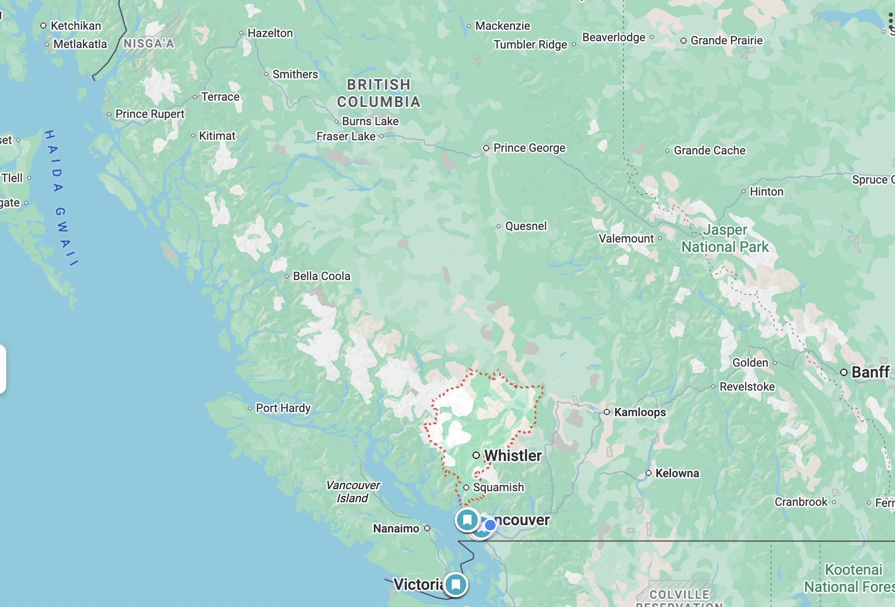
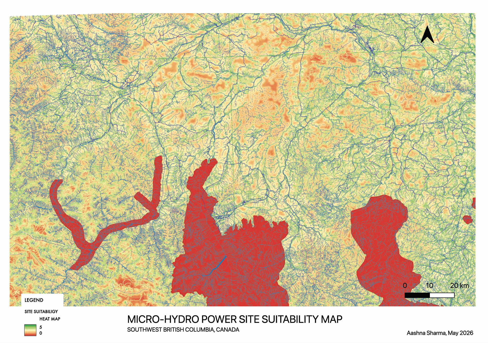

# MICRO-HYDROPOWER SITE SUITABILITY MAP

> The purpose of this project is to conduct a feasibility study to identify candidate locations for micro-hydropower development in Southwest BC considering terrain, river proximity, infrastructure access, and environmental constraints.

## OVERVIEW

Deliverables: suitability map, ranked candidate sites layer

Software: QGIS, Python, Git

Study Area Definition:
This feasibility analysis will be focused in the specific region of Southwest British Columbia, Canada (Squamish-Lillooet and Sunshine Coast regions) given the mountainous terrain, many streams, grid access, and manageable data sets.

## DATASET & LAYERS
1. Elevation (DEM) - _Source: https://a100.gov.bc.ca/ext/mtec/public/products/mapsheet_
2. Rivers and Streams - _Source: https://catalogue.data.gov.bc.ca/dataset/freshwater-atlas-stream-network_
3. Protected Areas - _Source: https://catalogue.data.gov.bc.ca/dataset/bc-parks-ecological-reserves-and-protected-areas_
4. Roads - _Source: https://catalogue.data.gov.bc.ca/dataset/digital-road-atlas-dra-demographic-partially-attributed-roads_
5. Transmission Lines - _Source: https://catalogue.data.gov.bc.ca/dataset/bc-transmission-lines_

## SUITABILITY CRITERIA

Each factor (elevation, proximity to river/stream, protected areas, proximity to road, and transmission lines) is converted to a score. A weighted sum is used to  provide final suggestions on ideal micro-hydro power project locations in Southwest BC.

### Criterion 1: Elevation
Rationale: Higher elevation provides higher potential (\(E_p = mgh\)

|    Slope   | Score |
| ---------- | ----- |
| 0-5 deg.   |   1   |
| 5-10 deg.  |   2   |
| 10-15 deg. |   3   |
| 15-25 deg. |   4   |
| >25 deg.   |   5   |

### Criterion 2: Proximity to Streams/Rivers
Rationale: Easier access to flowing water, shorter penstock length to minimize friction losses

| Distance  | Score |
| --------- | ----- |
|   <500m   |   5   |
| 500-800m  |   4   |
| 800-1000m |   3   |
|   1-2km   |   2   |
|   >2km    |   1   |

### Criterion 3: Proximity to Roads
Rationale: More efficient with respect to access, cost, and safety

| Distance | Score |
| -------- | ----- |
|   <1km   |   5   |
|   1-3km  |   4   |
|   3-4km  |   3   |
|   4-5km  |   2   |
|   >5km   |   1   |

### Criterion 4: Protected Areas
1. Inside protected area = 0
2. Outside protected area = 1

### Criterion 5: Proximity to Transmission Lines
Rationale: Minimizes energy loss, and reduces construction costs/time

| Distance | Score |
| -------- | ----- |
|   <1km   |   5   |
|  1-10km  |   4   |
|  10-30km |   3   |
|  30-50km |   2   |
|  >50km   |   1   |

### Weighted Sum
Suitability = ((40% Elevation Score) + (30% Stream Score) + (12% Road Score) + (18% Transmission Line Score)) x (Protected Areas Constraint)

## ASSUMPTIONS
1. Stream proximity data and use assumes nearby streams have usable flow
2. Steeper slopes are assumed to improve hydropower potential by increasing hydraulic head
3. Proximity to transmission infrastructure is assumed to ease grid connection feasibility
4. Protected areas are assumed unsuitable for development

## LIMITATIONS
1. Ecological impacts are not considered in this study
2. Raster resolution (25m DEM) ignores fine-scale site conditions
3. Some data may be incomplete/out of date
4. Regulatory constraints beyond protected areas are not considered
5. Dry season data of streams are not considered
6. Geological factors (ex. stability) not considered.

## FUTURE WORKS
Future work can include more data sets to address some of these limitations. Long-term data for water flow should be considered to understand seasonal variation.

## QGIS PROJECT DETAILS
CRS (Coordinate Reference System) used => EPSG:3005 – NAD83 / BC Albers

## Output

Red -> Yellow -> Green gradient represents areas from least suitable to most.
Due to British Columbia's rich geography in relation to flowing streams, and elevations, several candidate sites can be picked from this map, many exceeding over 1MW in hydroelectric capacity. For the next part of the project, a capacity of 100kW is assumed.

_Note: GIS raw data not included in repo_
